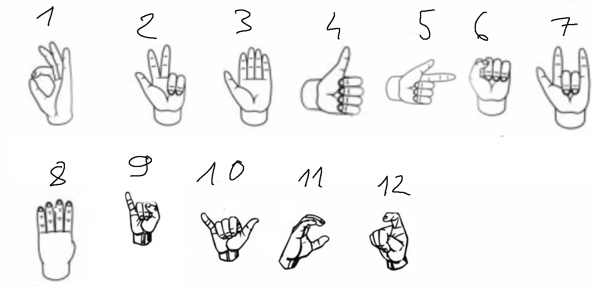

# Rozpoznawacz gestów

Program rozpoznający gesty.

Aktualnie został wytrenowany na poniższych gestach:

  

## Instalacja

Biblioteka do nakładania handmarków na dłoń nazywa się Mediapipe.
Wymagane pakiety są w pliku `requirements.txt`. 

## Foldery

### `./data`

W folderze `./data` znajdują się dane do trenowania sieci. Są one podzielone na foledery dla każdgo modelu, a następnie na pliki. Każdy plik zawiera tylko gesty danego typu bez etykiet, więc przy imporcie danych do trenowania sieci trzeba je dodać np. z nazwy pliku.

### `./lite`

Folder zawiera modele w wersji lite.

### `./models`

Ten folder natomiast zaweira wytrenowane i zapisane modele. Niestety z nieznanego nam powodu, modele wytrenowane na jednym komputerze nie chcą się włączyć na drugim.

### `./to_lite_data`

Tutaj znajdują się modele zapisane w formacie, który umożliwia eksport do wersji lite.

### `./tests`

W owym folderze znajdują się testy dla poszczególnych modeli, modeli-lite, i "główny" plik.

## Trenowanie sieci

Chcąc wytrenować model musimy zebrać dane przy pomocy `./cam_to_data.py` - pobiera jako argument folder wyjściowy.

Następnie mając już zapisane dane potrzebujemy wytrenować dla nich model. W tym celu mamy trzy pliki:
- `./model1.py`
- `./model2.py`
- `./model3.py`

Ale można utworzyć kolejne wzorując się na powyższych, zmieniając im np. warstwy. Ważne jest by modele miały input shape (21, 3) i output jako array z indeksami gestów.

Następnie najpewniej chcielibyśmy wytrenować supermodel, ale do tego potrzebujemy modeli lite. Także musimy użyć pliku `./to_lite.py` i wygenerować je na podstawie modeli uzyskanych z `./modelX.py`.

Niestety wszystko w `./super_model.py` jest statycznie. Więc trzeba tam pozmieniać nazwy folderów i ścieżek do modeli lite. Program sobie w środu zaczyta modele, dane i wygeneruje na ich podstawie nowy input dla modelu, a następnie wytrenuje go.

Mając super model mamy wszystko. 

Włączamy więc `./tests/sign_series_recognition.py` i "powinno działać". Tylko musimy upewnić się, że ścieżki działają itp. bo tutaj również wszyst ko jest statycznie.
Po pokazaniu gestu startu (domyślnie 5), pokazujemy serie gestów, którą kończymy gestem końca (domyślnie nr 4). Program zwraca nam listę gestów w kolejności, którą można wykorzystac do zakodowania jakiejś opcji np. do grania w szachy.

Jest też wersja mobilna, mająca dokładnie te same funkcjonalności co domyśla sieć, znajduje się ona w folderze `./Aplikacja_do_gestow`.

Aplikacja może ma też jeden analogowy gest, tj. zwracający wartość z przedziału (0, 1)(również mogę się mylić) - można go przetestować w `./tests/test_analog.py`.

  

